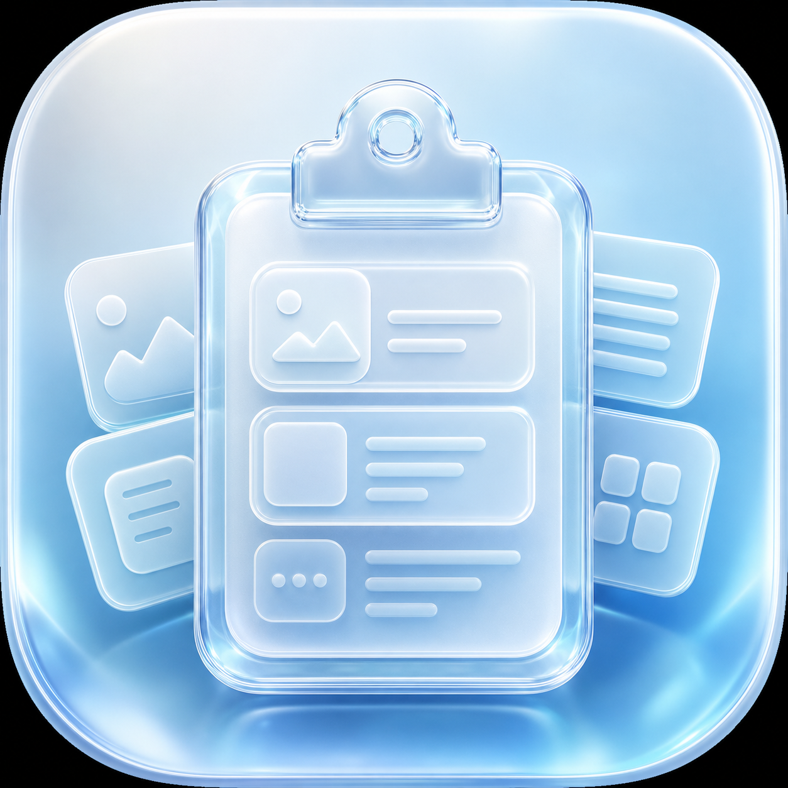

# 历史粘贴板 / HistoryClipboard

[中文](#中文) | [English](#english)



## 中文

一款简洁、轻量、仅在本机保存数据的 macOS 菜单栏剪贴板历史工具。

### 功能

- 自动记录最近复制的文字和图片
- 按时间倒序浏览历史
- 点击整张卡片重新复制内容
- 搜索文字记录
- 置顶或删除文字和图片记录
- 设置 1、3、5 天保存期限
- 置顶内容不自动过期
- 暂停记录或清空全部历史
- 可选开机启动
- 半透明淡蓝色液态玻璃界面

### 隐私

- 所有剪贴板历史仅保存在本机
- 不进行网络上传
- 不包含分析、追踪或遥测
- 不记录来源 App、窗口标题或网页地址

数据库和图片默认保存在：

```text
~/Library/Application Support/HistoryClipboard/
```

### 系统要求

- macOS 13 或更高版本
- Xcode 14.3.1 或兼容版本
- Swift 5.8 或兼容版本

### 本地开发

克隆项目后，在项目根目录运行：

```bash
swift build
swift run HistoryClipboard
```

也可以使用 Xcode 打开 `Package.swift`。

### 打包与安装

生成 macOS App：

```bash
scripts/package-app.sh
```

输出位置：

```text
dist/HistoryClipboard.app
```

安装到当前用户的应用目录：

```bash
scripts/install-local.sh
```

默认安装位置为 `~/Applications/HistoryClipboard.app`。

### 项目结构

```text
Sources/HistoryClipboard/  Swift 源码
Assets/AppIcon/            应用图标
scripts/                   打包和本地安装脚本
```

### 当前状态

第一版核心功能和手动验收已完成。当前打包产物尚未进行 Apple Developer ID 签名和公证，因此仓库默认不提交 `dist/`。

### 参与贡献

提交问题或代码前，请阅读 [CONTRIBUTING.md](CONTRIBUTING.md)。

### 许可证

本项目采用 [MIT License](LICENSE)。

## English

HistoryClipboard is a simple, lightweight macOS menu bar app that stores clipboard history locally on your Mac.

### Features

- Automatically records recently copied text and images
- Displays clipboard history in reverse chronological order
- Copies an item back to the clipboard by clicking its card
- Searches text history
- Pins or deletes text and image items
- Supports retention periods of 1, 3, or 5 days
- Keeps pinned items from expiring automatically
- Pauses recording or clears all history
- Optionally launches at login
- Uses a translucent light-blue liquid-glass interface

### Privacy

- All clipboard history stays on your Mac
- No data is uploaded over the network
- No analytics, tracking, or telemetry
- No source app, window title, or webpage address is recorded

The database and image files are stored in:

```text
~/Library/Application Support/HistoryClipboard/
```

### Requirements

- macOS 13 or later
- Xcode 14.3.1 or a compatible version
- Swift 5.8 or a compatible version

### Local Development

After cloning the repository, run:

```bash
swift build
swift run HistoryClipboard
```

You can also open `Package.swift` with Xcode.

### Packaging and Installation

Build the macOS app bundle:

```bash
scripts/package-app.sh
```

The app bundle will be generated at:

```text
dist/HistoryClipboard.app
```

Install it in the current user's Applications directory:

```bash
scripts/install-local.sh
```

The default installation path is `~/Applications/HistoryClipboard.app`.

### Project Structure

```text
Sources/HistoryClipboard/  Swift source code
Assets/AppIcon/            App icon assets
scripts/                   Packaging and local installation scripts
```

### Project Status

The core features and manual acceptance checks for the first version are complete. The current app bundle has not yet been signed or notarized with an Apple Developer ID, so `dist/` is not committed to the repository.

### Contributing

Please read [CONTRIBUTING.md](CONTRIBUTING.md) before opening an issue or submitting code.

### License

This project is licensed under the [MIT License](LICENSE).
